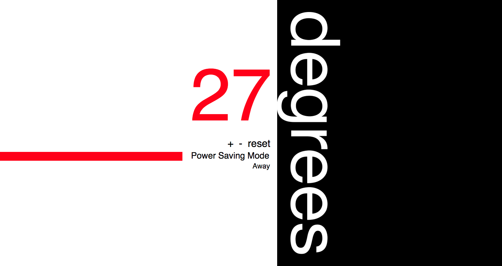

Thermostat
=======================

## Introduction

## Brief
* Thermostat starts at 20 degrees
* You can increase the temp with the up button
* You can decrease the temp with the down button
* The minimum temperature is 10 degrees
* If power saving mode is on, the maximum temperature is 25 degrees
* If power saving mode is off, the maximum temperature is 32 degrees
* Power saving mode is on by default
* You can reset the temperature to 20 by hitting the reset button
* Thermostat should color the display based on energy usage - < 18 is green, < 25 is yellow, otherwise red

### Added features
* Has an away button which turns thermostat to min (or a set temperature)
* should know the current time

## Technologies Used

- Javascript
- Jasmine
- CSS

## Enhancements

- [ ] Side bar should change colour when the degrees changes colour
- [ ] Should be able to set a timer so temperature goes up between set hours.

## Favourite Code Snippet

~~~
 TODO: paste code here
~~~

## Collaborators

- NAME_ONE (http://www.github.com/USERNAME)
- NAME_TWO (http://www.github.com/USERNAME)

## Still to complete/refactor

- [ ]
- [ ]

## Takeaway

TODO: Enter a personal reflection and/or things you learnt
